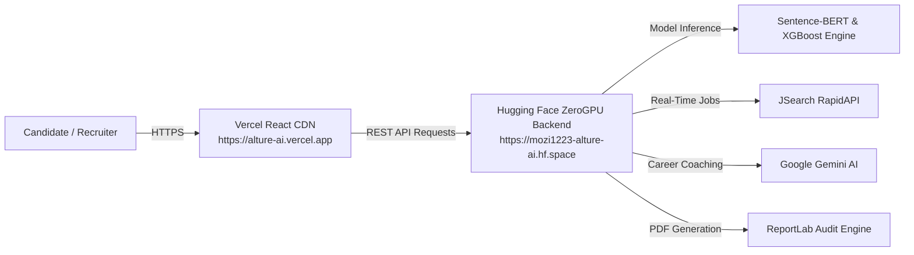

# 🚀 Alture AI — Production Deployment Architecture

Alture AI is deployed across modern serverless cloud infrastructure for **100% free**, decoupled high-performance operation:

---

## 🌐 Live Production Architecture



---

## ⚡ 1. Frontend: Deployed on Vercel
* **URL**: [https://alture-ai.vercel.app](https://alture-ai.vercel.app)
* **Hosting**: Vercel Global Edge CDN
* **Repository Source**: `Ahmad-Mustafa-Iqbal/Alture-AI` (Folder: `deployment/frontend/`)
* **Features**:
  * Dynamic `API_BASE_URL` routing
  * Glassmorphism dark-mode UI
  * Real-time ATS match breakdown and interactive visual charts
  * Instant PDF Audit Report download

---

## 🤗 2. Backend: Deployed on Hugging Face Spaces (ZeroGPU)
* **URL**: [https://huggingface.co/spaces/Mozi1223/Alture-AI](https://huggingface.co/spaces/Mozi1223/Alture-AI)
* **Direct API Endpoint**: `https://mozi1223-alture-ai.hf.space`
* **Hardware Tier**: ZeroGPU (Free NVIDIA Acceleration)
* **Features**:
  * FastAPI Asynchronous Microservice
  * Dual-mounted endpoints (`/v1` and `/api/v1`)
  * Full CORS and Preflight Options handling
  * Pinned `starlette<0.38.0` for high stability

---

## 💻 3. Local Development

To run the full stack locally:

```bash
# 1. Install dependencies
pip install -r requirements.txt

# 2. Start FastAPI Backend Server
python -m uvicorn deployment.backend.main:app --host 127.0.0.1 --port 8000 --reload

# 3. Open Frontend
# Navigate to deployment/frontend/index.html in any modern browser
```
